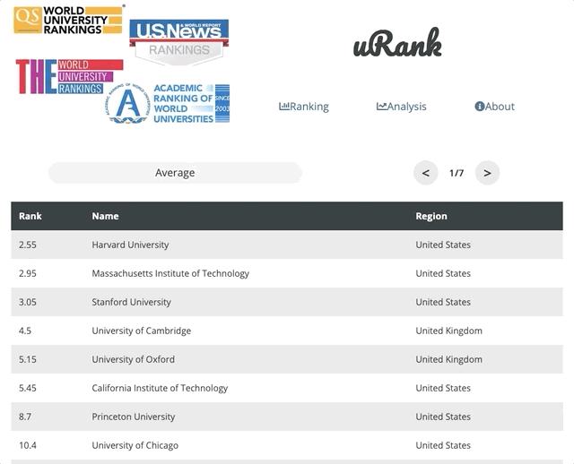
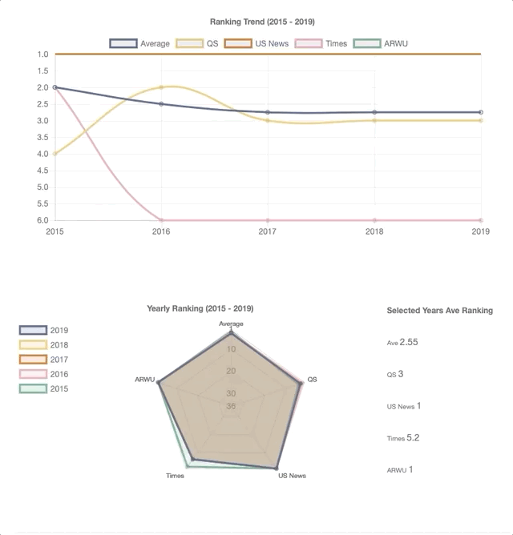

# 

#### Update Plan 
- [ ] Update data for year 2020.
- [ ] Will use mongoDB instead of local JSON file for DB.
- [ ] Will change the domain to Netlify. (Next is good, but now.sh performance is disastrous and I don't know why)
- [ ] Will add more universities to the DB (now 150 target 200)
- [ ] UI using Bulma.
- [ ] Maybe rewrite to use React hooks.

### Summary

**[uRank](https://urank.now.sh)** is the all-in-one website to find rankings of your favourite global university, where you can find four most influential global rankings in the world:

- [QS](https://www.topuniversities.com) (*QS World University Rankings*)
- [US News](https://www.usnews.com/education/best-global-universities) (*Best Global University Ranking*)
- [Times](https://www.timeshighereducation.com) (*Times Higher Education World University Rankings*)
- [ARWU](http://www.shanghairanking.com) (*Shanghai Academic Ranking of World Universities*)

You can find the past 5 years (2015-2019) data on specific ranking, alone with its average:

Also, to see the analysis charts of one university:

### Data

I am not able to find all the data from the ranking official websites. The data sources are listed below:

* QS Ranking 2016-2019: [QS official website](https://www.topuniversities.com/university-rankings/world-university-rankings/2019)
* QS Ranking 2015: [Web archive](https://web.archive.org)
* US News Ranking 2019: [US News official website](https://www.usnews.com/education/best-global-universities/rankings)
* US News Ranking 2015-2018: [Qianmu](http://www.qianmu.org)
* ARWU Ranking 2015-2019: [ARWU official website](http://www.shanghairanking.com/ARWU2018.html) (ARWU 201(*n*)= ARWU201(*n+1*))
* Times Ranking 2015-2019: [THE official website](https://www.timeshighereducation.com/world-university-rankings/2019/world-ranking#!/page/0/length/25/sort_by/rank/sort_order/asc/cols/stats)

**NOTE: I have to correct some of the data by hand so more universities will be added in the future**

### Technology Stack Outline

* Fully written in [React.js](https://reactjs.org)
* Using framework [Next.js](https://nextjs.org)
* Charts supported by [Chart.js](https://www.chartjs.org)
* CSS styled by CSS-in-JS using [styled components](https://www.styled-components.com)
* Typography using [Google Font](https://fonts.google.com/?selection.family=Open+Sans|Pacifico) *Open Sans*, *Pacifico* and *Montserrat*
* Data collection using Python [Scrapy](https://scrapy.org)
* Useful CSS Layout Tutorials:
  * CSS Flexbox Layout: [A Complete Guide to Flexbox](https://css-tricks.com/snippets/css/a-guide-to-flexbox/), [Flexbox](https://developer.mozilla.org/en-US/docs/Learn/CSS/CSS_layout/Flexbox)
  * CSS Grid Layout: [A Complete Guide to Grid](https://css-tricks.com/snippets/css/complete-guide-grid/), [Grids](https://developer.mozilla.org/en-US/docs/Learn/CSS/CSS_layout/Grids)

